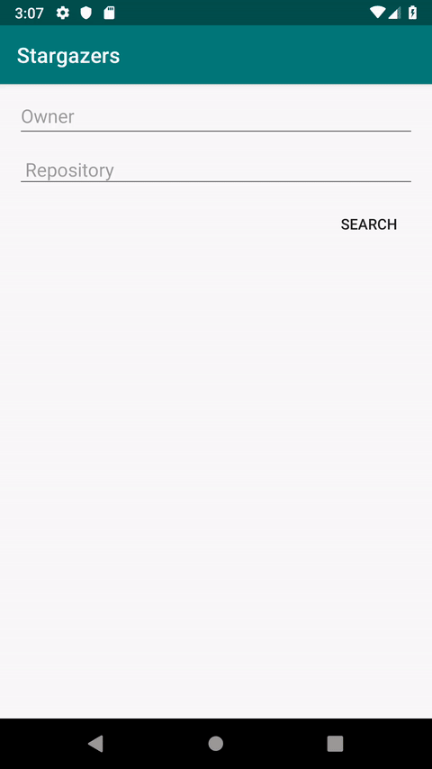

# Stargazers

Sample application for [Stargazers GitHub api](https://developer.github.com/v3/activity/starring/#list-stargazers)

## CLI

- build: `./gradlew app:assembleDebug`
- run unit tests: `./gradlew app:testDebugUnitTest`

## DEMO

## Credits

* [Kotlin](https://kotlinlang.org/)
* [Android JetPack / Architecture Components](https://developer.android.com/jetpack/)
* [Retrofit](http://square.github.io/retrofit/)
* [Glide](https://github.com/bumptech/glide)
* [Dagger](https://google.github.io/dagger/)
* [JUnit](http://junit.org/junit4/)
* [Mockito](https://github.com/nhaarman/mockito-kotlin)

## Notes

- `PageKeyedDataSource` has been used in order to properly support api pagination.
- For effects, Kotlin coroutines (with Retrofit coroutine adapter)
- The architecture is a pretty basic MVVM.
